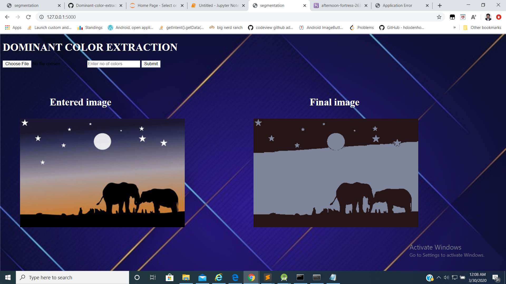
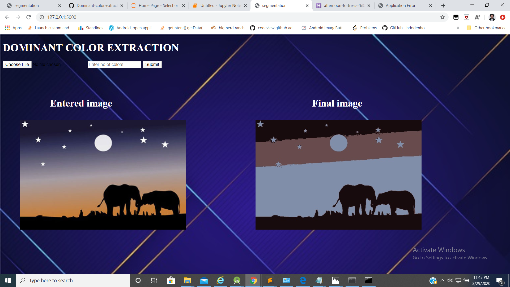
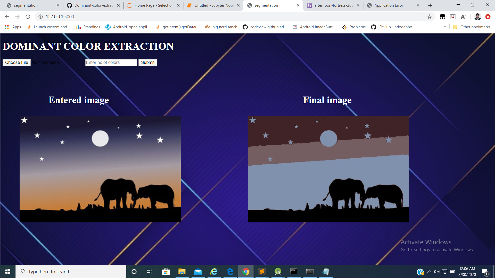

# Dominant-Color-for-Image-Segmentation
This repository contains a web application on finding the dormant color for image segmentation. The python code uses kmeans clustering algorithm for finiding the dormant color in the image, and generate a new image with those dormant colours only. However, number of dormant colors is a user specified parameter.

# Dependencies

Flask
Numpy
Matplotlib
OpenCV
Scipy

# Instruction
#### Run flask run to run the server.
#### Input an image and desired number of colours in the edited image.
# Results

## Image with 2 Colors 

## Image with 3 Colors 

## Image with 4 Colors 

